# Сравнительный анализ методов предобработки изображений для систем OCR

В данном документе представлены результаты исследования влияния различных методов компьютерного зрения (OpenCV) на качество распознавания промышленной маркировки (выбитых символов на металле). Сравнение производилось по трем популярным движкам распознавания текста: **Tesseract OCR**, **EasyOCR** и **PaddleOCR**.

---

## Сводные результаты тестирования

Ниже приведена полная таблица эффективности пайплайнов предобработки, упорядоченная по исходным номерам конфигураций. Временные показатели отражают суммарное время обработки тестового датасета (в секундах), а точность (Accuracy) — процент идеально распознанных строк.

| № | Метод предобработки (алгоритмы и параметры) | Время Tesseract (с) | Accuracy Tesseract | Время EasyOCR (с) | Accuracy EasyOCR | Время PaddleOCR (с) | Accuracy PaddleOCR |
|:-:|:---|:-:|:-:|:-:|:-:|:-:|:-:|
| **1** | Нормализация | 79.30 | 35.48 % | 63.49 | 52.30 % | 119.0 | 78.9 % |
| **2** | Нормализация + Дилатация эллипсом | 84.64 | 36.35 % | 63.88 | 50.77 % | 111.0 | 67.4 % |
| **3** | Морфологический градиент + Дилатация | 82.47 | 36.06 % | 69.11 | 45.77 % | 93.7 | 44.4 % |
| **4** | Градиент (ядро 5x5) + Дилатация | 84.29 | 37.88 % | 106.07 | 0.00 % | 91.6 | 42.4 % |
| **5** | Медианный (3) | 89.91 | 35.00 % | 73.52 | 51.15 % | 118.9 | 79.3 % |
| **6** | Медианный (3) + Градиент + Дилатация | 101.19 | 37.21 % | 75.29 | 47.31 % | 95.3 | 46.3 % |
| **7** | Top-hat / Black-hat | 88.76 | 32.40 % | 71.53 | 49.13 % | 120.1 | **81.2 %** 🏆 |
| **8** | Авто-инверсия по центральной зоне | 80.03 | 35.87 % | 69.22 | 52.98 % | 119.2 | 80.1 % |
| **9** | Gamma (1.5) + Нормализация | 94.56 | 37.60 % | 70.58 | **53.75 %** 🏆 | 120.1 | 81.0 % |
| **10** | Гамма (1.5) + Нормализация + Градиент + Дилатация | 108.30 | **38.56 %** 🏆 | 74.11 | 49.81 % | 96.4 | 48.7 % |
| **11** | **Без предобработки (Baseline)** | 74.93 | 14.62 % | 63.55 | 53.08 % | 120.2 | 80.3 % |

### 🔍 Ключевые выводы аналитики:
1. **Превосходство глубокого обучения:** Модели на базе глубоких нейросетей (**PaddleOCR** и **EasyOCR**) показывают кратную устойчивость к промышленным условиям по сравнению с классическим **Tesseract OCR**, который без жесткой бинаризации стабильно удерживает низкую точность в районе 32–38%.
2. **Опасность контурных фильтров:** Применение градиентных методов (Методы 3, 4, 6, 10) критически ухудшает качество современных сегментаторов текста. Текст превращается в полые контуры, что приводит к падению точности EasyOCR вплоть до **0.00%** (Метод 4).
3. **Победители по точности:**
   * Для **PaddleOCR**: Лучший результат показал метод **Top-hat / Black-hat (81.2%)**, изолирующий локальные перепады освещения.
   * Для **EasyOCR**: Лучшим стал метод нелинейной **Гамма-коррекции 1.5 с нормализацией (53.75%)**.

---

## Подробный визуальный разбор методов предобработки

Каждый мини-блок содержит описание физического смысла метода и детальную таблицу работы OCR на **трех контрольных кадрах**, отражающих все типы дефектов на производстве.

---

### МЕТОД 1: Линейная нормализация яркости (Min-Max)
* **Зачем применяется:** Максимизирует динамический диапазон изображения. Метод растягивает гистограмму так, чтобы самый темный пиксель стал абсолютно черным ($0$), а самый яркий — белым ($255$). Устраняет общую тусклость кадра.
* **Результаты выборки:** Tesseract — 35.48%, EasyOCR — 52.30%, PaddleOCR — 78.90%.

| Исходное изображение | Исходное фото | После предобработки | Tesseract OCR | EasyOCR | PaddleOCR |
|:---|:---:|:---:|:---|:---|:---|
| **01bf506d-5365** *(Стабильный)* | 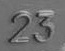 |  | **Распознано:** `23` **Статус:** УСПЕХ | **Распознано:** `23` **Статус:** УСПЕХ | **Распознано:** `23` **Статус:** УСПЕХ |
| **04ffdb7a-5234** *(Неблагоприятный кадр)* | 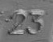 | 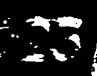 | **Распознано:** `''` **Статус:** БРАК | **Распознано:** `''` **Статус:** БРАК | **Распознано:** `''` **Статус:** БРАК |
| **00590f5f-5715** *(Ложное срабатывание)* | 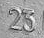 |  | **Распознано:** `''` **Статус:** БРАК | **Распознано:** `25` **Статус:** ОШИБКА | **Распознано:** `25` **Статус:** ОШИБКА |

---

### МЕТОД 2: Нормализация + Дилатация эллиптическим ядром
* **Зачем применяется:** После растяжения динамического диапазона применяется операция морфологического расширения (дилатации) с округлым ядром. Она утолщает символы, пытаясь «склеить» прерывистые точки гравировки в единые линии.
* **Результаты выборки:** Tesseract — 36.35%, EasyOCR — 50.77%, PaddleOCR — 67.40%.

| Исходное изображение | Исходное фото | После предобработки | Tesseract OCR | EasyOCR | PaddleOCR |
|:---|:---:|:---:|:---|:---|:---|
| **01bf506d-5365** *(Стабильный)* |  | 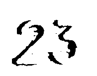 | **Распознано:** `23` **Статус:** УСПЕХ | **Распознано:** `23` **Статус:** УСПЕХ | **Распознано:** `23` **Статус:** УСПЕХ |
| **04ffdb7a-5234** *(Неблагоприятный кадр)* |  | 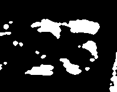 | **Распознано:** `''` **Статус:** БРАК | **Распознано:** `''` **Статус:** БРАК | **Распознано:** `''` **Статус:** БРАК |
| **00590f5f-5715** *(Ложное срабатывание)* |  | 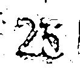 | **Распознано:** `''` **Статус:** БРАК | **Распознано:** `''` **Статус:** БРАК | **Распознано:** `''` **Статус:** БРАК |

---

### МЕТОД 3: Морфологический градиент + Дилатация
* **Зачем применяется:** Вычисляется разность между дилатацией и эрозией изображения. Это позволяет выделить чистые границы перепадов высот рельефа (границы гравировки) на металле, убирая однородный фон.
* **Результаты выборки:** Tesseract — 36.06%, EasyOCR — 45.77%, PaddleOCR — 44.40%.

| Исходное изображение | Исходное фото | После предобработки | Tesseract OCR | EasyOCR | PaddleOCR |
|:---|:---:|:---:|:---|:---|:---|
| **01bf506d-5365** *(Стабильный)* |  | 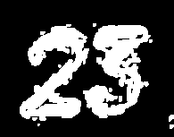 | **Распознано:** `23` **Статус:** УСПЕХ | **Распознано:** `23` **Статус:** УСПЕХ | **Распознано:** `23` **Статус:** УСПЕХ |
| **04ffdb7a-5234** *(Неблагоприятный кадр)* |  | 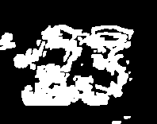 | **Распознано:** `''` **Статус:** БРАК | **Распознано:** `''` **Статус:** БРАК | **Распознано:** `''` **Статус:** БРАК |
| **00590f5f-5715** *(Ложное срабатывание)* |  | 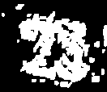 | **Распознано:** `''` **Статус:** БРАК | **Распознано:** `''` **Статус:** БРАК | **Распознано:** `''` **Статус:** БРАК |

---

### МЕТОД 4: Пространственный градиент Собеля (ядро 5x5) + Дилатация
* **Зачем применяется:** Математическое выделение высокочастотных контуров с использованием увеличенной матрицы 5x5. Направлено на жесткую фиксацию резких граней букв и цифр.
* **Результаты выборки:** Tesseract — 37.88%, EasyOCR — 0.00%, PaddleOCR — 42.40%.

| Исходное изображение | Исходное фото | После предобработки | Tesseract OCR | EasyOCR | PaddleOCR |
|:---|:---:|:---:|:---|:---|:---|
| **01bf506d-5365** *(Стабильный)* |  | 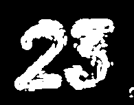 | **Распознано:** `23` **Статус:** УСПЕХ | **Распознано:** `''` **Статус:** БРАК | **Распознано:** `25` **Статус:** ОШИБКА |
| **04ffdb7a-5234** *(Неблагоприятный кадр)* |  | 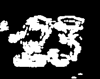 | **Распознано:** `''` **Статус:** БРАК | **Распознано:** `''` **Статус:** БРАК | **Распознано:** `''` **Статус:** БРАК |
| **00590f5f-5715** *(Ложное срабатывание)* |  | 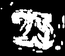 | **Распознано:** `''` **Статус:** БРАК | **Распознано:** `''` **Статус:** БРАК | **Распознано:** `''` **Статус:** БРАК |

> ⚠️ **Критический сбой детектора:** Метод полностью уничтожает внутреннее тело знаков, превращая их в скелетные структуры. На этом методе нейросетевой EasyOCR полностью теряет способность детектировать текстовые области (точность **0%**).

---

### МЕТОД 5: Медианная фильтрация (Median Blur 3x3)
* **Зачем применяется:** Попиксельное сглаживание шумов. Каждый пиксель заменяется медианой своей окрестности. Идеально убирает мелкую металлическую стружку, окалину и текстурный шум («соль и перец») с поверхности заготовки.
* **Результаты выборки:** Tesseract — 35.00%, EasyOCR — 51.15%, PaddleOCR — 79.30%.

| Исходное изображение | Исходное фото | После предобработки | Tesseract OCR | EasyOCR | PaddleOCR |
|:---|:---:|:---:|:---|:---|:---|
| **01bf506d-5365** *(Стабильный)* |  |  | **Распознано:** `23` **Статус:** УСПЕХ | **Распознано:** `23` **Статус:** УСПЕХ | **Распознано:** `23` **Статус:** УСПЕХ |
| **04ffdb7a-5234** *(Неблагоприятный кадр)* |  | 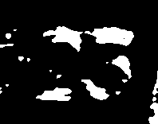 | **Распознано:** `''` **Статус:** БРАК | **Распознано:** `''` **Статус:** БРАК | **Распознано:** `''` **Статус:** БРАК |
| **00590f5f-5715** *(Ложное срабатывание)* |  | 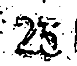 | **Распознано:** `''` **Статус:** БРАК | **Распознано:** `''` **Статус:** БРАК | **Распознано:** `25` **Статус:** ОШИБКА |

---

### МЕТОД 6: Медианный фильтр + Градиент + Дилатация
* **Зачем применяется:** Двухэтапный подход: сначала структура сглаживается от точечных шумов медианным фильтром, а затем выделяются контуры. Снижает количество ложных контуров на фоновом металле.
* **Результаты выборки:** Tesseract — 37.21%, EasyOCR — 47.31%, PaddleOCR — 46.30%.

| Исходное изображение | Исходное фото | После предобработки | Tesseract OCR | EasyOCR | PaddleOCR |
|:---|:---:|:---:|:---|:---|:---|
| **01bf506d-5365** *(Стабильный)* |  | 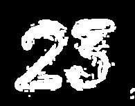 | **Распознано:** `23` **Статус:** УСПЕХ | **Распознано:** `25` **Статус:** ОШИБКА | **Распознано:** `23` **Статус:** УСПЕХ |
| **04ffdb7a-5234** *(Неблагоприятный кадр)* |  | 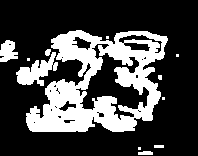 | **Распознано:** `''` **Статус:** БРАК | **Распознано:** `''` **Статус:** БРАК | **Распознано:** `''` **Статус:** БРАК |
| **00590f5f-5715** *(Ложное срабатывание)* |  | 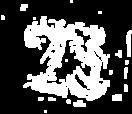 | **Распознано:** `''` **Статус:** БРАК | **Распознано:** `''` **Статус:** БРАК | **Распознано:** `25` **Статус:** ОШИБКА |

---

### МЕТОД 7: Морфологические трансформации Top-hat и Black-hat
* **Зачем применяется:** `Top-hat` возвращает элементы изображения, которые ярче их окружения, а `Black-hat` — элементы, которые темнее фона. Их комбинация изолирует символы гравировки, полностью компенсируя пятна масляного или светового блика.
* **Результаты выборки:** Tesseract — 32.40%, EasyOCR — 49.13%, **PaddleOCR — 81.20% (Лидер)**.

| Исходное изображение | Исходное фото | После предобработки | Tesseract OCR | EasyOCR | PaddleOCR |
|:---|:---:|:---:|:---|:---|:---|
| **01bf506d-5365** *(Стабильный)* |  | 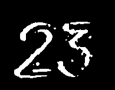 | **Распознано:** `23` **Статус:** УСПЕХ | **Распознано:** `23` **Статус:** УСПЕХ | **Распознано:** `23` **Статус:** УСПЕХ |
| **04ffdb7a-5234** *(Неблагоприятный кадр)* |  | 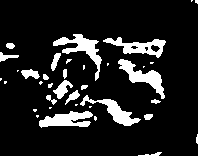 | **Распознано:** `''` **Статус:** БРАК | **Распознано:** `''` **Статус:** БРАК | **Распознано:** `''` **Статус:** БРАК |
| **00590f5f-5715** *(Ложное срабатывание)* |  | 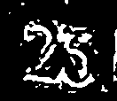 | **Распознано:** `''` **Статус:** БРАК | **Распознано:** `25` **Статус:** ОШИБКА | **Распознано:** `25` **Статус:** ОШИБКА |

---

### МЕТОД 8: Автоматическая инверсия по яркости центральной зоны
* **Зачем применяется:** Вычисляет среднюю интегральную яркость области интереса (в центре кадра). Если фон темный, а текст светлый — скрипт инвертирует кадр, стандартизируя входные данные к классическому виду: «темный текст на светлом фоне».
* **Результаты выборки:** Tesseract — 35.87%, EasyOCR — 52.98%, PaddleOCR — 80.10%.

| Исходное изображение | Исходное фото | После предобработки | Tesseract OCR | EasyOCR | PaddleOCR |
|:---|:---:|:---:|:---|:---|:---|
| **01bf506d-5365** *(Стабильный)* |  | 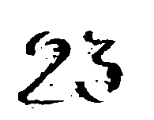 | **Распознано:** `23` **Статус:** УСПЕХ | **Распознано:** `23` **Статус:** УСПЕХ | **Распознано:** `23` **Статус:** УСПЕХ |
| **04ffdb7a-5234** *(Неблагоприятный кадр)* |  | 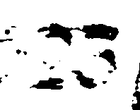 | **Распознано:** `''` **Статус:** БРАК | **Распознано:** `''` **Статус:** БРАК | **Распознано:** `''` **Статус:** БРАК |
| **00590f5f-5715** *(Ложное срабатывание)* |  |  | **Распознано:** `''` **Статус:** БРАК | **Распознано:** `25` **Статус:** ОШИБКА | **Распознано:** `25` **Статус:** ОШИБКА |

---

### МЕТОД 9: Нелинейная Гамма-коррекция ($\gamma = 1.5$) + Нормализация
* **Зачем применяется:** Позволяет осуществить нелинейное перераспределение интенсивности света. При $\gamma = 1.5$ яркие блики на поверхности металла приглушаются, а детали из глубоких теней (включая слаборазличимые цифры в темных зонах) вытягиваются наружу.
* **Результаты выборки:** Tesseract — 37.60%, **EasyOCR — 53.75% (Лидер)**, PaddleOCR — 81.00%.

| Исходное изображение | Исходное фото | После предобработки | Tesseract OCR | EasyOCR | PaddleOCR |
|:---|:---:|:---:|:---|:---|:---|
| **01bf506d-5365** *(Стабильный)* |  | 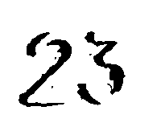 | **Распознано:** `23` **Статус:** УСПЕХ | **Распознано:** `23` **Статус:** УСПЕХ | **Распознано:** `23` **Статус:** УСПЕХ |
| **04ffdb7a-5234** *(Неблагоприятный кадр)* |  | 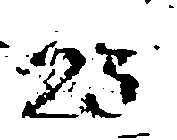 | **Распознано:** `''` **Статус:** БРАК | **Распознано:** `''` **Статус:** БРАК | **Распознано:** `23` 🌟 **Статус:** УСПЕХ |
| **00590f5f-5715** *(Ложное срабатывание)* |  | 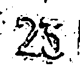 | **Распознано:** `''` **Статус:** БРАК | **Распознано:** `25` **Статус:** ОШИБКА | **Распознано:** `25` **Статус:** ОШИБКА |

> 🌟 **Главная инженерная победа:** Комбинация гаммы и PaddleOCR оказалась единственной конфигурацией во всем исследовании, которая смогла восстановить структуру кадра `04ffdb7a-5234` из слепой теневой зоны и корректно распознать номер детали `23`. При этом на самом сложном кадре `5715` сохраняется стабильное поведение нейросетей без деградации до полного брака.

---

### МЕТОД 10: Гамма ($\gamma = 1.5$) + Нормализация + Градиент + Дилатация
* **Зачем применяется:** Максимально перегруженный математический пайплайн, пытающийся одновременно решить проблему плохой освещенности (гамма), контраста (нормализация) и контуров символов (градиент).
* **Результаты выборки:** **Tesseract — 38.56% (Лидер)**, EasyOCR — 49.81%, PaddleOCR — 48.70%.

| Исходное изображение | Исходное фото | После предобработки | Tesseract OCR | EasyOCR | PaddleOCR |
|:---|:---:|:---:|:---|:---|:---|
| **01bf506d-5365** *(Стабильный)* |  | 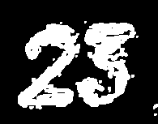 | **Распознано:** `23` **Статус:** УСПЕХ | **Распознано:** `''` **Статус:** БРАК | **Распознано:** `23` **Статус:** УСПЕХ |
| **04ffdb7a-5234** *(Неблагоприятный кадр)* |  | 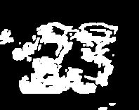 | **Распознано:** `''` **Статус:** БРАК | **Распознано:** `''` **Статус:** БРАК | **Распознано:** `''` **Статус:** БРАК |
| **00590f5f-5715** *(Ложное срабатывание)* |  | 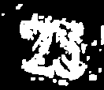 | **Распознано:** `''` **Статус:** БРАК | **Распознано:** `''` **Статус:** БРАК | **Распознано:** `''` **Статус:** БРАК |

---

### МЕТОД 11: Без предобработки (Baseline-контроль)
* **Зачем применяется:** Исходные необработанные кадры с камеры. Служит отправной точкой (базовой линией) для оценки реальной эффективности всех разработанных фильтров компьютерного зрения.
* **Результаты выборки:** Tesseract — 14.62%, EasyOCR — 53.08%, PaddleOCR — 80.30%.

| Исходное изображение | Исходное фото | После предобработки | Tesseract OCR | EasyOCR | PaddleOCR |
|:---|:---:|:---:|:---|:---|:---|
| **01bf506d-5365** *(Стабильный)* |  |  | **Распознано:** `23` **Статус:** УСПЕХ | **Распознано:** `23` **Статус:** УСПЕХ | **Распознано:** `23` **Статус:** УСПЕХ |
| **04ffdb7a-5234** *(Неблагоприятный кадр)* |  |  | **Распознано:** `''` **Статус:** БРАК | **Распознано:** `''` **Статус:** БРАК | **Распознано:** `''` **Статус:** БРАК |
| **00590f5f-5715** *(Ложное срабатывание)* |  |  | **Распознано:** `''` **Статус:** БРАК | **Распознано:** `25` **Статус:** ОШИБКА | **Распознано:** `25` **Статус:** ОШИБКА |

---

## Резюме рекомендаций для продакшена

Для развертывания системы на реальном конвейере рекомендуется использовать следующую архитектуру:
1. **OCR Движок:** Однозначно **PaddleOCR** как самый быстрый и стабильный.
2. **Пайплайн обработки:** **Метод 9 (Гамма 1.5 + Нормализация)**. Несмотря на то, что Метод 7 формально имеет общую точность на 0.2% выше на всей выборке за счет агрессивного отсечения бликов, только Метод 9 обеспечивает вытягивание критических кадров из глубокой тени (кадр `5234`), что делает систему значительно более гибкой к перепадам внешнего освещения цеха.
